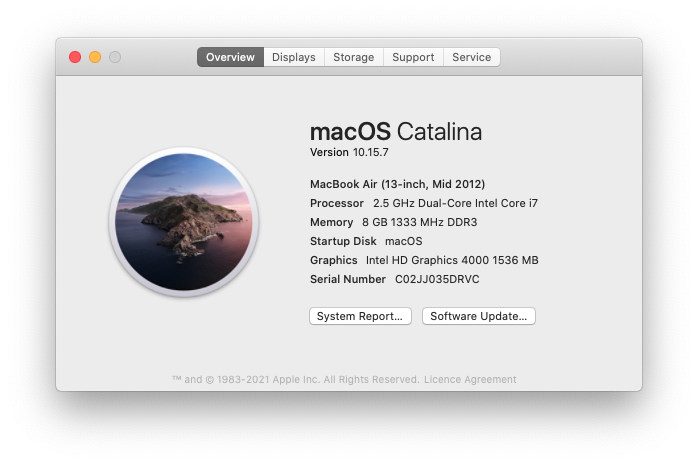

# X1 Carbon 2013 hackintosh EFI（OpenCore）

`Nov 11,2021 by Yale Wei`
***

Based on [X230](https://github.com/banhbaoxamlan/X230-Hackintosh) repository。

#### Status：Final Version

     

#### Config

| Name               | Information                                    |
| ----------------   | ---------------------------------------        |
| CPU                | Intel® Core™ i7-3667u                          |
| iGPU               | Intel® HD4000                                  |
| Lan                | None                                           |
| Audio              | Realtek ALC269                                 |
| Ram                | 8GB DDR3L 1333 MHz                             |
| Wifi + Bluetooth™  | Intel Centrino® Advanced-N6205S + Bluetooth 4.0|
| Fingerprint Reader | AuthenTec Fingerprint Reader                   |
| Nvme               | None                                           |
| SSD                | Intel® SSD 240GB                               |
| Multicard Reader   | 4-in-1 reader                                  |
| SMBIOS             | MacBookAir5,2                                  |
| BootLoader         | OpenCore 0.6.6                                 |
| BIOS               | 2.85 

#### Drivers

- [x] Intel® HD4000 iGPU miniDP Output
- [x] ALC269 Internal Speakers
- [x] ALC269 miniDP Audio Output
- [x] All USB Ports 
- [x] SpeedStep / Sleep / Wake
- [x] Intel Centrino® Advanced-N6205S0 + Bluetooth 4.0
- [-] Fingerprint Reader
- [-] Multicard Reader
- [x] NVRAM 

#### Issues

1. Now the itlwm.kext doesn't support AirDrop，but the HandOff is good. 
2. The monitor would have no signals sometimes when the system is running Big Sur, then you need to reset the nvram this time and reboot the machine.
3. When runnig Catalina, SecureBootModel needs to set *Default* for driving AirportItlwm.kext, but running Monterey needs to set *Disabled* for booting the system.

### Buy me a coffee

| WeChat Pay | Alipay | 
| ---| --- |
|  |  |

### Credits

[Apple](https://www.apple.com) for macOS

[Acidanthera](https://github.com/acidanthera) 

[Rehabman](https://github.com/RehabMan) and [daliansky](https://github.com/daliansky) 

[zxystd](https://github.com/OpenIntelWireless/itlwm) for Itlwm

[zhen-zen](https://github.com/zhen-zen/YogaSMC) for YogaSMC

[MSzturc](https://github.com/MSzturc) for ThinkpadAssistant

[Dortania](https://dortania.github.io/OpenCore-Install-Guide/) for OpenCore Guide

[gitee.com](https://gitee.com) 

[github.com](https://github.com) 